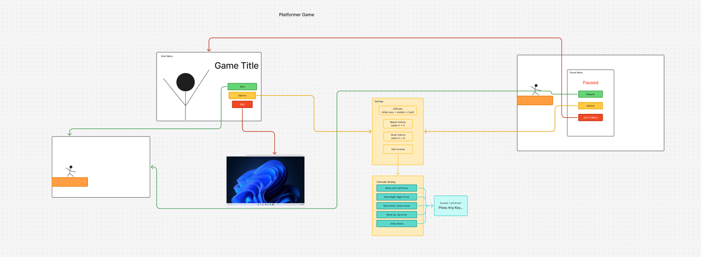

# Game UX

This project is meant to be a reusable main menu and other common menu UIs you see in games, that you can just add to your own project so you don't have to remake the same boilerplate menu every time

Figma wireframe link:  
https://www.figma.com/board/1rqtVUw2zqXFbUeZqL3P8I/GameUI?node-id=13-133&t=BldT56Iuwi79HhSL-0

## Time constraints:

* Wireframe - we were able to complete the wireframe in class, in about 1.5 hours.
* Settings Menu UI and theme - This took about 6 hours to implement and polish
    * Main settings menu ~ 2 hr
        * Layout ~ 1 hr
        * Volume controls ~ 1 hr
    * Key binding submenu ~ 3 hr
        * Procedural generation of ui elements based on project input map ~ 1 hr
        * Listen to input/Rebind mechanic ~ 1 hr
        * Layouts ~ 1hr
    * Theme/sfx ~ 1 hr

## Credits:

* UI Graphics - [By Wenrexa](https://opengameart.org/content/assets-free-interface-ui-dark-miko)  
* Menu Music - [made with beepbox](https://www.beepbox.co/#9n31sak0l00e06t1Aa7g0fj07r1i0o432T1v1u37f0qwx10l511d03AbF6B0Q07beP9996E2b6636T5v4u42f0qwx10l511d03H_RBHBziiii9998h0E1b7T1v3ufbf0q00d02A0F0B0Q9000Pf000E250617T4v1u04f10w4qw02z6666ji8k8k3jSBKSJJAArriiiiii07JCABrzrrrrrrr00YrkqHrsrrrrjr005zrAqzrjzrrqr1jRjrqGGrrzsrsA099ijrABJJJIAzrrtirqrqjqixzsrAjrqjiqaqqysttAJqjikikrizrHtBJJAzArzrIsRCITKSS099ijrAJS____Qg99habbCAYrDzh00E0b4y4i000000018x4g0000010y0x000000gicQ0000000p24vBWpsomi5GwqkZeyyhFBZJwrHAQveZNBO_u5K5J8YP2fcI8X2fcMOM96Cn6EjhXchUgQ4ujxbghMd6khMZ69IOY0V0JCzY34rCzV1UzjhX11IQuzu1lAuAqurUyq_oeAuMGOhg96DzOl62Fd7OnRpGdlp9vlya5lpeQPNUvEMmpABYBAFZtCp9vvAFZtCp85di81kQpN7AyVx7AFBaEasAnq8XdijFcFRB41gCL4kQpRv7tNRtBRn7smh-dUbNB5J76YrnNCyYnrphNL5QkR9ENq35EcmwNg)  
* UI Sounds - [Generated with JFXR](https://sfxr.me/)  
